# 日本橋ランチ情報スキル

このワークショップでは、既存のkintoneアプリにalexaの音声インターフェースを追加する方法を習得します。

今回はkintoneのサンプルアプリとして、日本橋界隈のランチ情報が登録されている「日本橋ランチ情報」アプリを使用します。このアプリは実際にサイボウズ社内で使用されていたものに若干手を加えたものです。

## 1. kintoneの日本橋ランチ情報アプリ

今回はあらかじめ作っておいたアプリに、AlexaスキルからkintoneのREST APIを使用して接続するようにします。

受講者の方は以下のURLとアカウントでアクセスできます。

URL: [https://devofphia.cybozu.com/](https://devofphia.cybozu.com/)

ログイン情報

| User | Pass |
|---|---|
|alexa.student.01|alexa##2018|
|alexa.student.02|alexa##2018|
|alexa.student.03|alexa##2018|
|alexa.student.04|alexa##2018|

もし日本橋界隈のランチのお店をご存知でしたらレコードを追加してみてください。

尚、このkintoneアプリのテンプレートはこちらから[ダウンロード](https://github.com/toshimin/Nihonbashi-Lunch-Skill/blob/master/kintoneApp/LunchAppTemplate.zip)できます。
kintoneアプリに読み込み可能なkintoneデータファイルはこちらから[ダウンロード](https://github.com/toshimin/Nihonbashi-Lunch-Skill/blob/master/%E6%97%A5%E6%9C%AC%E6%A9%8B%E3%83%A9%E3%83%B3%E3%83%81%E6%83%85%E5%A0%B1%E3%83%87%E3%83%BC%E3%82%BF(UTF-8).csv)できます。

## 2. kintoneアプリに音声インターフェースを追加する

日本橋ランチ情報アプリは社員同士で会社の近くのランチ情報を共有できる便利なデータベースです。

さらに、このアプリに登録されている情報を音声で呼び出せるとしたらどうでしょうか？
いちいちパソコンやスマホを開かなくても、alexaに声で聞くだけで今日のおすすめを教えてくれます。

「今日は中華がいいなぁ」
「焼肉がいいなぁ」
「オムライスが食べたい」

といった自然な問いかけとするだけでおすすめのお店を教えてくれるのです。素敵でしょ？

Alexaを使ってこんなスキルを作ってみたいと思います。

## 3. Alexaスキルの概要

AlexaスキルとKintoneをつなぐシステムダイアグラムは以下のようになります。

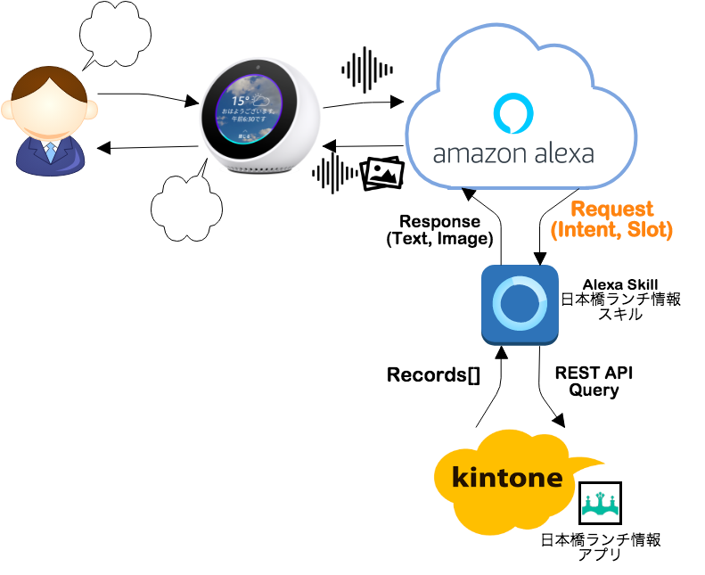

通常、Alexaのスキル開発では、人間が話す音声を解析してリクエストイベント（インテントとスロット）を発生させ、Alexaスキルに送信する部分（対話モデルと言います）と、何らかの処理をしてAlexaのクラウドサービスにテキストや音声でレスポンスを返す部分（エンドポイント）の開発の2つのフェーズがあります。

エンドポイントは、開発者がホスティングした独自のサーバーでも構いませんが、開発及び運用コストのメリットから、[AWSのLambda](https://aws.amazon.com/jp/lambda)と言うサーバーレスアプリケーションサービスが良く利用されます。

kintoneなど、他のサービスとの接続は、このLambdaから公開されているAPIコールを使って情報を取得したり、何かサービスやデバイスをコントロールするのが一般的な方法です。

今回のワークショップでは、エンドポイントの部分はあらかじめ用意されています。受講者の方は、図のオレンジ色の部分に相当する**対話モデルのデザイン**を行っていただきます。

## 4. Alexaスキルの開発

Alexaスキルを開発は、以下のステップで行います。

1. **アマゾンの開発者アカウントを作成する**
2. **開発者ポータルのAlexa Skills Kit にアクセスする**
3. **Alexaとどのような会話をするのかシナリオを考える（音声インターフェースデザイン）**
4. **スキルビルダーを使って、対話モデルに入力する**
5. AWSのLambdaを使ってエンドポイントのコードを書く（ここでKintoneと接続するためのコードを含める）
6. 対話モデルにエンドポイントを登録してスキルが完成する
7. AlexaシミュレーターまたはEchoデバイスを使ってテストをする
8. Alexaスキルの完成
9.  公開申請し公開する

今回は、1から4、および6,7のステップを行います。

ステップ6のLambdaコードの書き方に興味がある方は、このGitHubリポジトリにある、[lambda/custom/index.js](https://github.com/toshimin/Nihonbashi-Lunch-Skill/blob/master/lambda/custom/index.js) を参照してください。

### 4-1 開発者アカウントを作成する

1. インターネットに接続されているパソコンで、Firefox または Chrome ブラウザを使用してください。
2. Echoデバイスをお持ちの方は、それをセットアップした時に使用したアマゾンのログインアカウント（メールアドレス）を用意してください。
3. [開発者ポータル](https://developer.amazon.com)にアクセスし、左上のDeveloper Consoleをクリックします。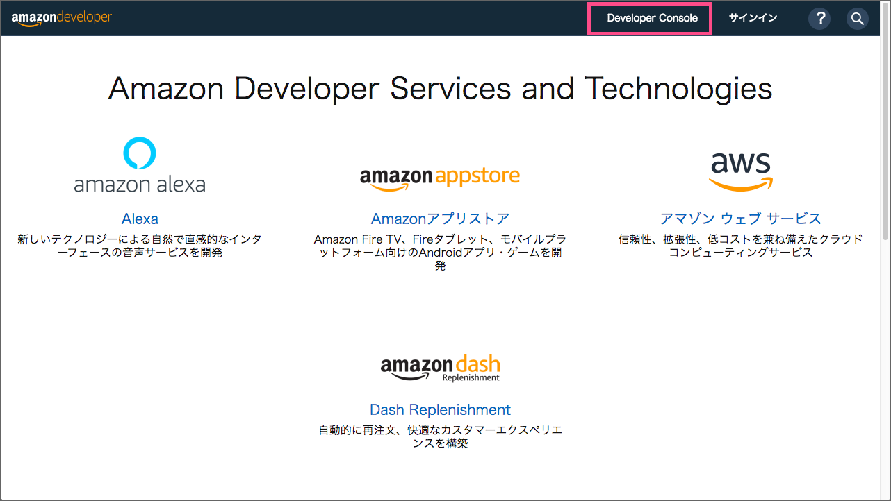
4. 用意したアマゾンのアカウントでログインします。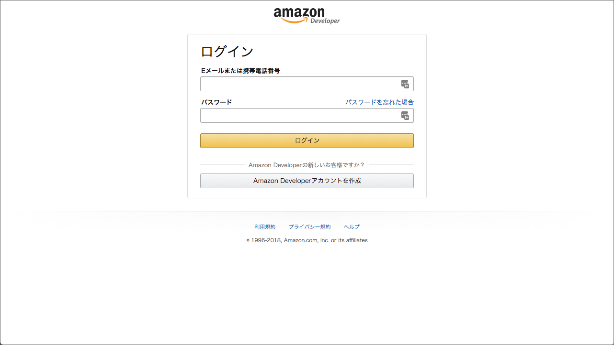
5. 二段階認証を求められたら指示に従い、認証コードを入力します。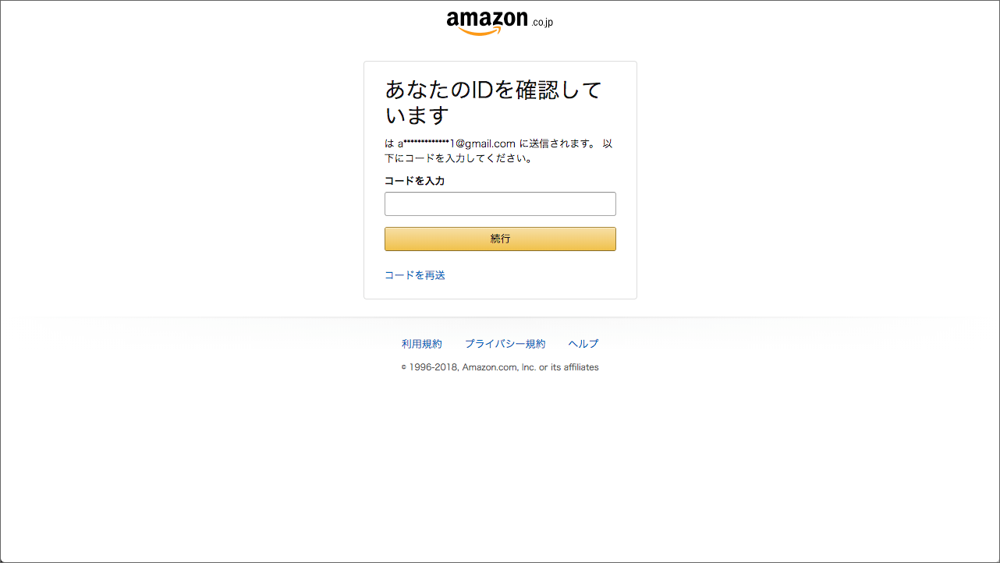
6. 開発者のプロフィール情報で必要項目を全て入力してください。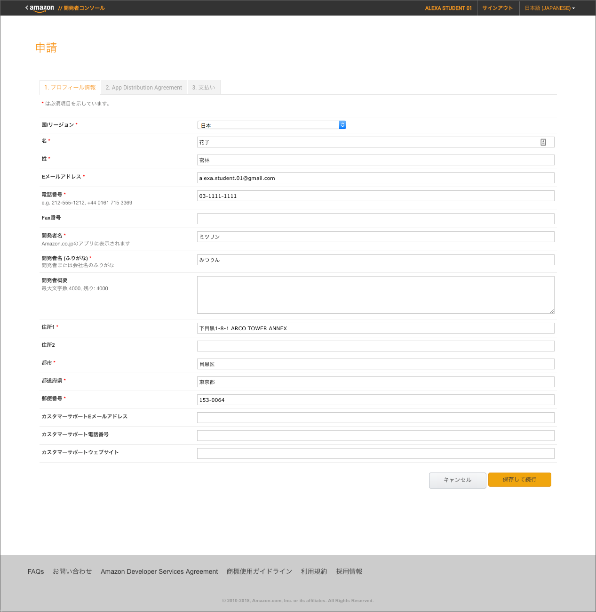
7. 利用規約に同意してください。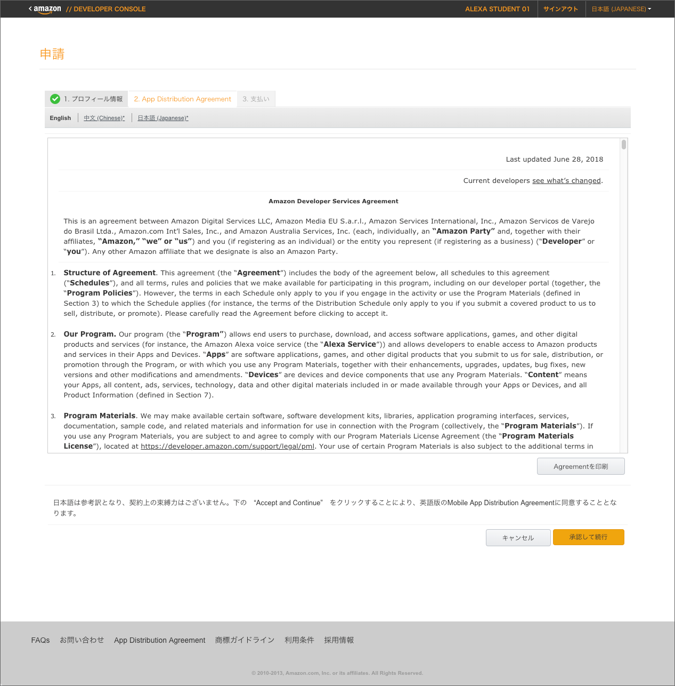
8. 支払いに関する項目を確認し「承認して実行」ボタンをクリックします。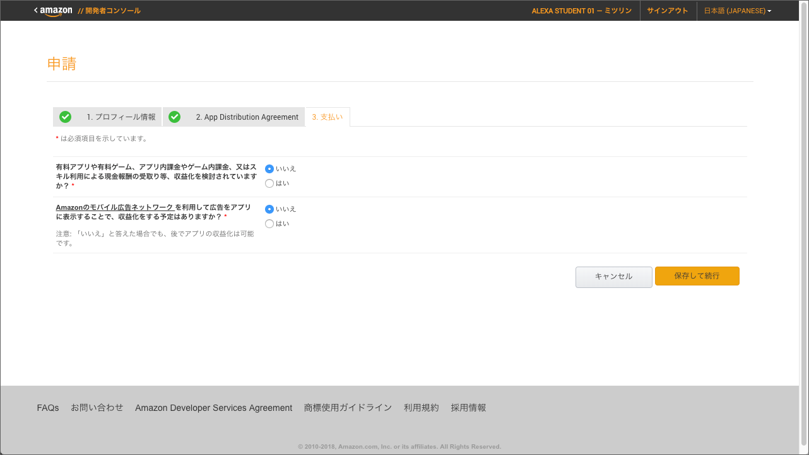
9. ログインした状態で開発者ポータルのトップ画面が開きます。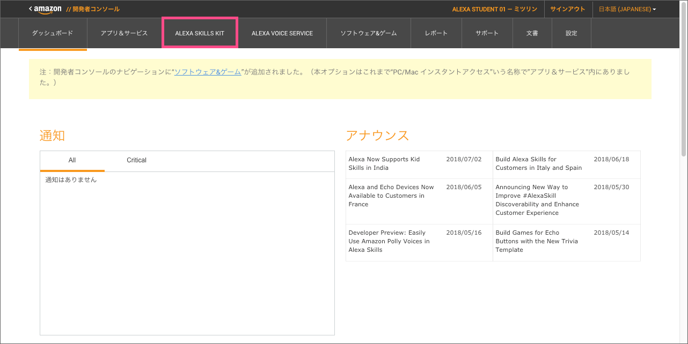
10. **[ALEXA SKILLS KIT]** のメニューをクリックすると、Alexa開発者コンソールの画面が開きます。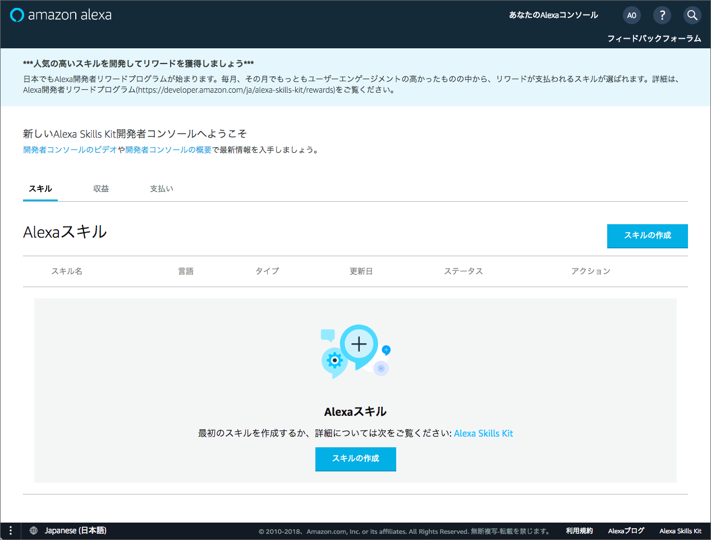

### 4-2 Alexaとどのような会話をするのかシナリオを考える（音声インターフェースデザイン)

さて、もう一度kintoneの日本橋ランチ情報のデータベースを見てみましょう。以下のような項目があります。

|項目名|フィールド名|タイプ|値のサンプル|
|---|---|---|---|
|店名|shop_name| 文字列(一行)|来々軒|
|店名よみがな|shop_name_kana|文字列(複数行)|らいらいけん|
|ジャンル|genre|ドロップダウン|中華料理|
|予算|budget|ラジオボタン|500円から1000円|
|店までの所要時間（分）|time|文字列(一行)|5|
|味|rating_taste|ドロップダウン|0-5|
|コスパ|rating_cospa|ドロップダウン|0-5|
|提供の早さ| rating_quickdelivery|ドロップダウン|0-5|
|雰囲気| rating_atmosphere |ドロップダウン|0-5|
|分煙| smoking_area |ラジオボタン|あり/なし|
|説明|shop_details|複数行文字列|このお店のいいところは・・・|
|URL|homepage_url|文字列(一行)||
|住所|address|文字列(一行)|東京都中央区|
|画像URL|image_url|文字列(一行)|EchoSpotとAlexaアプリのホームカードに表示される画像のURL (https必須)|

#### 課題1
ここからどのような自然な会話で情報を入手できたら良いかユーザー目線で考えてみましょう。あなたが最も快適だと思う会話例を考えてみてください。できるだけ多く紙に書き出してください。

ユーザーの発話例：「中華料理が食べたいな」、「1000円未満でランチが食べられるお店を教えて」

アレクサの応答例：「来々軒がおすすめです。所要時間は5分です。・・・・」、「来々軒はいかがですか？予算は500円から1000円で、ここから歩いて5分のところにあります。・・・」

* 会話はできるだけ自然に、軽く短くするのがポイントです。
* 一回で期待したお店を言ってくれなかった場合はどうしますか？
* どのようにして会話を終了させますか？
* 使い方がわからなくなった場合は何と言ってもらいますか？
* もしEcho Spotのように、デバイスに画面がついていたら何を表示しますか？

#### 課題2
では、検索できるキーは「ジャンル」のみだとしたらどのような会話になるか考えてみましょう。
日本橋ランチ情報アプリに入っているジャンルの種類は以下の通りです。

ジャンル：韓国料理、和食、焼肉、カフェ、アジアン、洋食、中華、カレー、イタリアン

* Alexaが聞き返すことなく、一度の発話でAlexaがユーザーから必要な情報を入手できる発話例はどのようなものでしょうか？
* ユーザーがジャンルを指定してくれなかった場合、どのような会話になりますか？

#### 課題3
1. 同じ要求（インテント）をしている会話をグループ化しましょう。
2. 会話の中でパラメータになりうる単語（スロット）の部分を丸で囲みましょう。
 
----
* 「おすすめのお店の情報を教えて欲しい」という要求に RecommendIntentという名前をつけます。

### 4-4 スキルビルダーを使って、対話モデルに入力する

それでは、Alexaの開発者コンソールで、あなたが作った発話例を元に対話モデルを完成させましょう。

1. 「スキルの作成」ボタンをクリックします。
	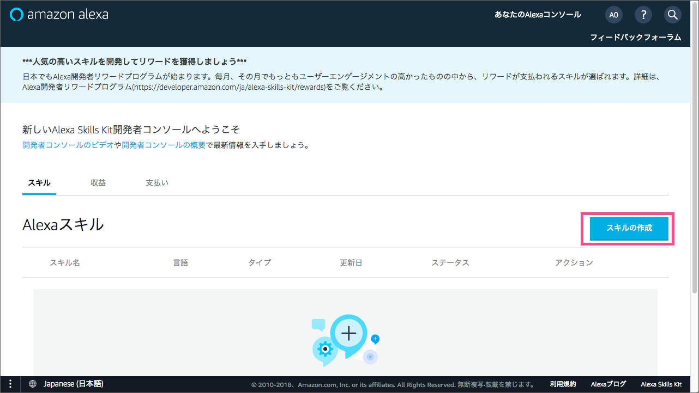
2. スキル名をつけます。ここでは「日本橋ランチ情報」と入力し、デフォルトの言語を日本語に変更します。スキルに追加するモデルは「カスタム」を選択し、「スキルを作成」ボタンをクリックします。
	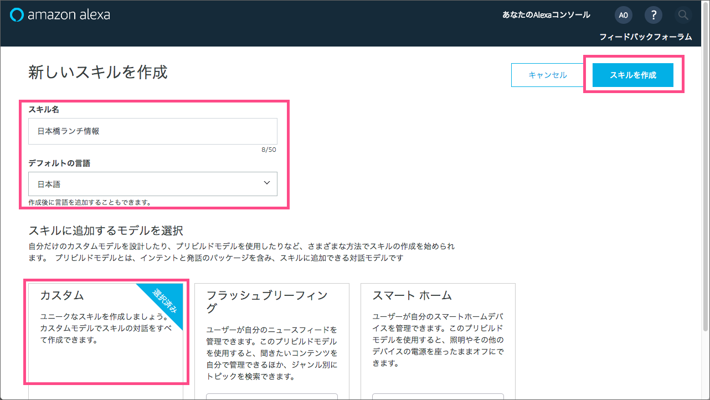
3. スキルビルダーの画面が開きます。右側のチェックボックスを上から順に設定してゆきます。まず初めに「呼び出し名」を設定しましょう。[**1. 呼び出し名**] の枠をクリックします。
	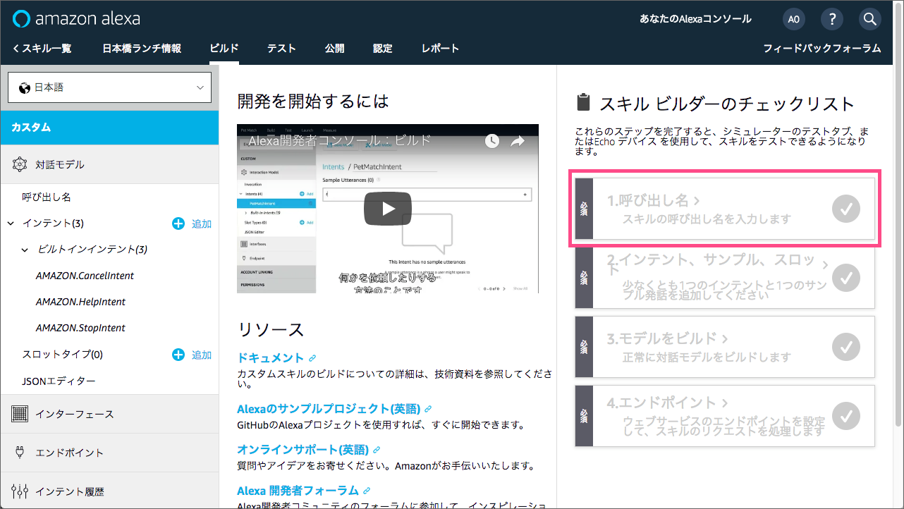
4. スキルの呼び出し名は「日本橋ランチ情報」にしましょう。他の呼び出し名に変更する場合は、ページ記載の要件に従う必要があります。「**モデルを保存**」ボタンをクリックし、左パネルの「**カスタム**」をクリックします。
	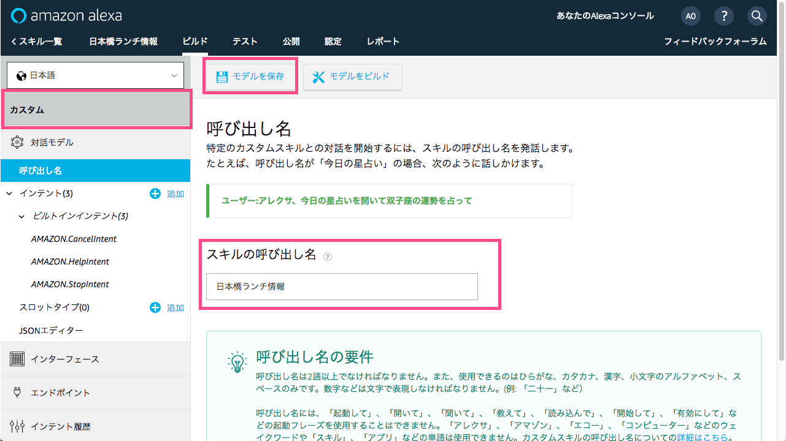
5. 続いて[**2. インテント、サンプル、スロット**] の枠をクリックします。
	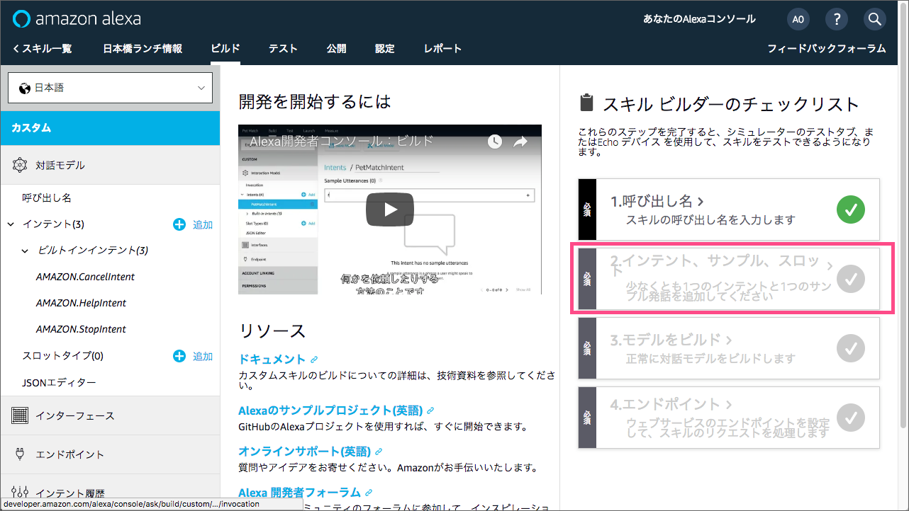
6. カスタムインテントを1つ作成します。インテントの名前を「**RecommendIntent**」と入力します。スペルを間違えていないか再確認し、「**カスタムインテントを作成**」ボタンをクリックします。
	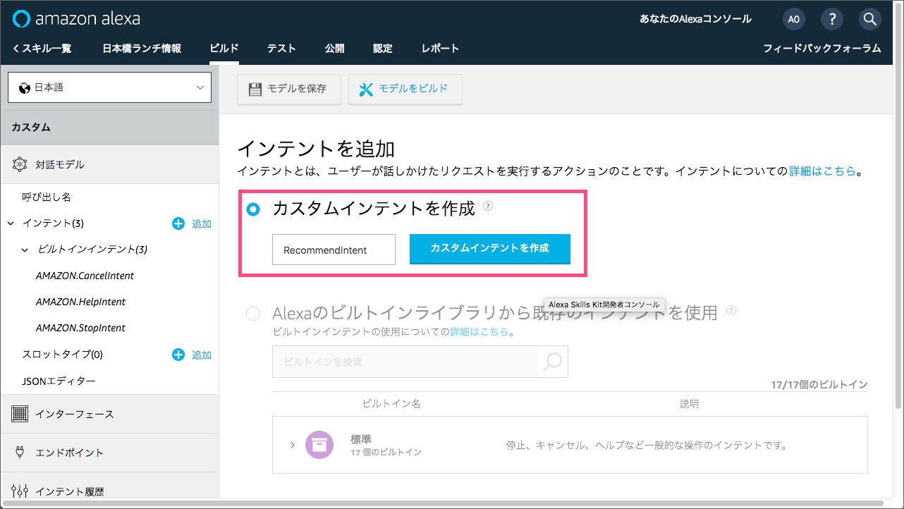
7. 課題3で書き出したおすすめのお店の情報を要求する言い方の例をできるだけ多く入力します。(最低10個、一括編集機能を使うと素早く入力できます）
	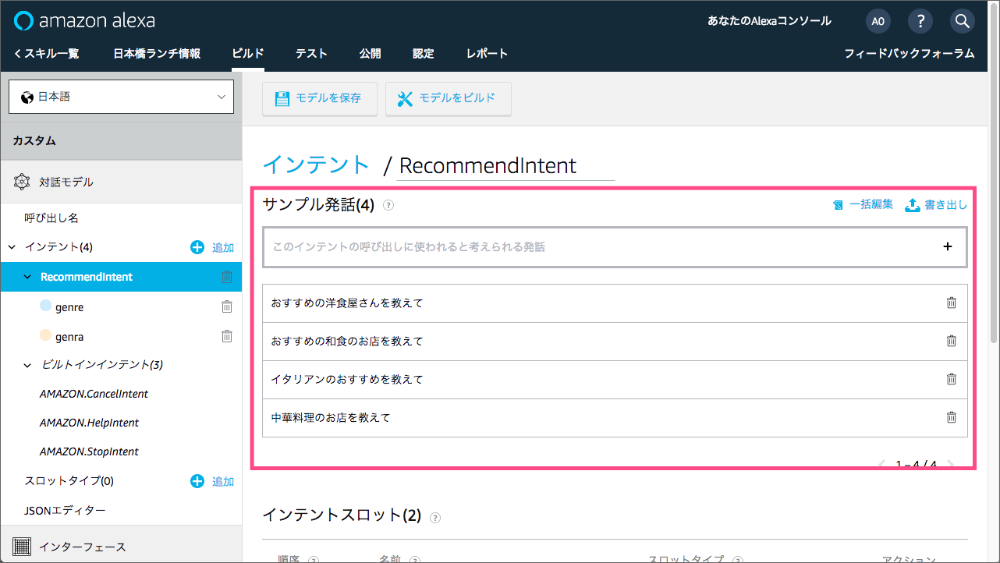
8. 次にスロットに相当する文字列の部分を選択します。するとポップアップ画面が表示されます。新しいスロットを作成の入力枠に「genre」と入力し「追加」ボタンをクリックします。他のサンプル発話も同様にスロットの部分を **{genre}**となるように変更します。
	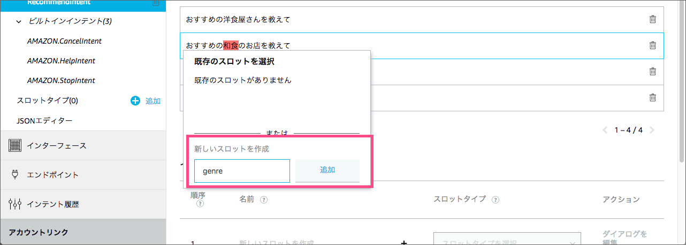
9. インテントスロットの表示部分をクリックすると、以下のような画面になるはずです。次に、左のパネルのスロットタイプの右横の「追加」ボタンをクリックします。
	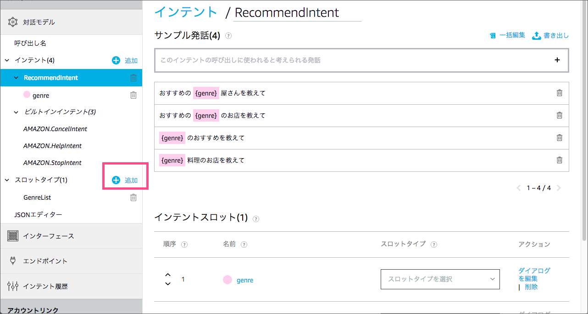
10. カスタムスロットタイプを作成します。「GenreList」と入力し「カスタムスロットタイプを作成」ボタンをクリックします。
	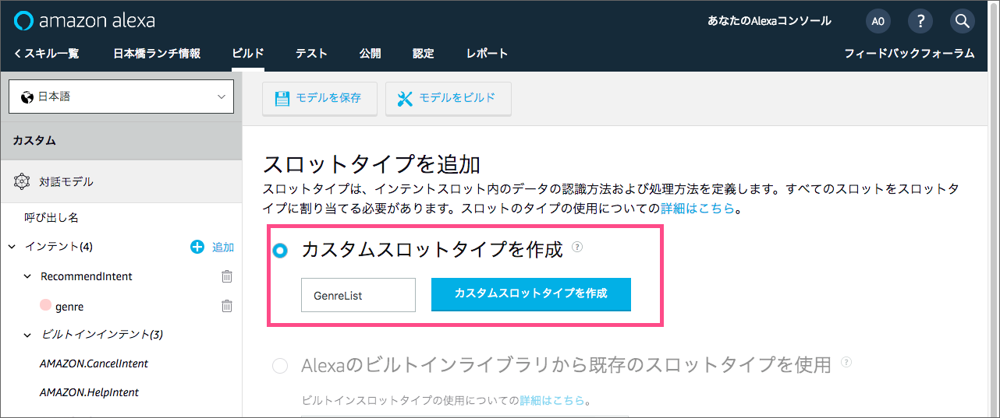
11. 以下のようにスロット値とIDを全て入力します。

	|スロット値| ID |
	|---|---|
	|韓国料理|01|
	|和食|02|
	|焼肉|03|
	|カフェ|04|
	|アジアン|05|
	|洋食|06|
	|中華|07|
	|カレー|08|
	|イタリアン|09|

	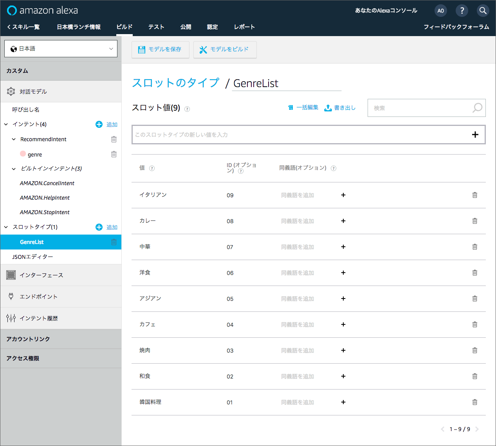
12. 左パネルのRecommendIntentをクリックし、インテントスロットの**genre**のスロットタイプを**GenreList**に設定します。
	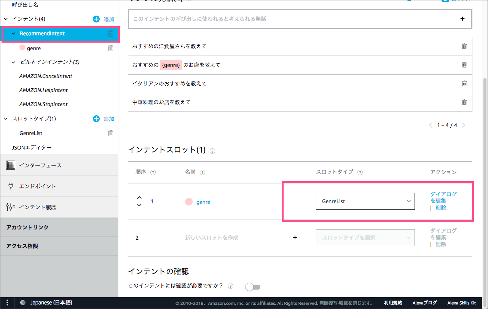
13. ここで「モデルを保存」をクリックし、さらに「モデルをビルド」をクリックします。モデルのビルドには1〜2分かかります。
	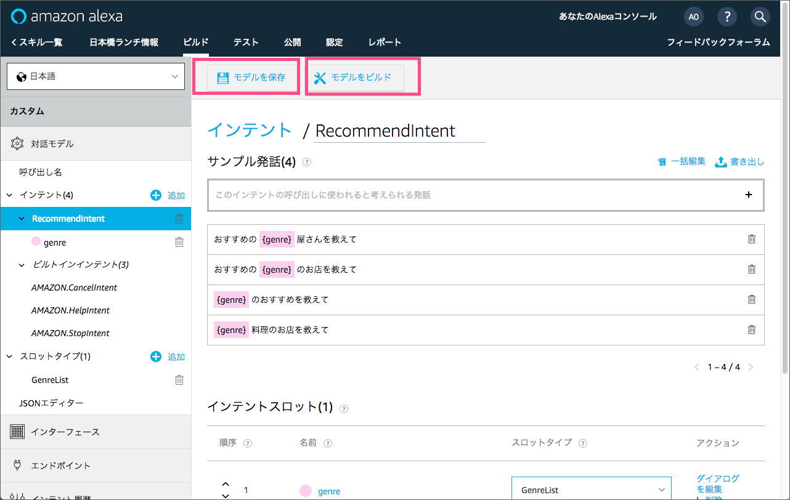
14. ビルドが完了すると、画面右下に以下のようなメッセージが表示されます。
	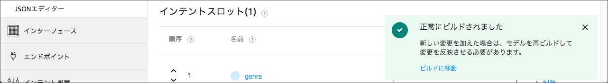
15. 今回のスキルはEcho Spot対応にする予定です。ここでディスプレイを操作するインターフェースを追加しておきます。左パネルの「インターフェース」をクリックします。
	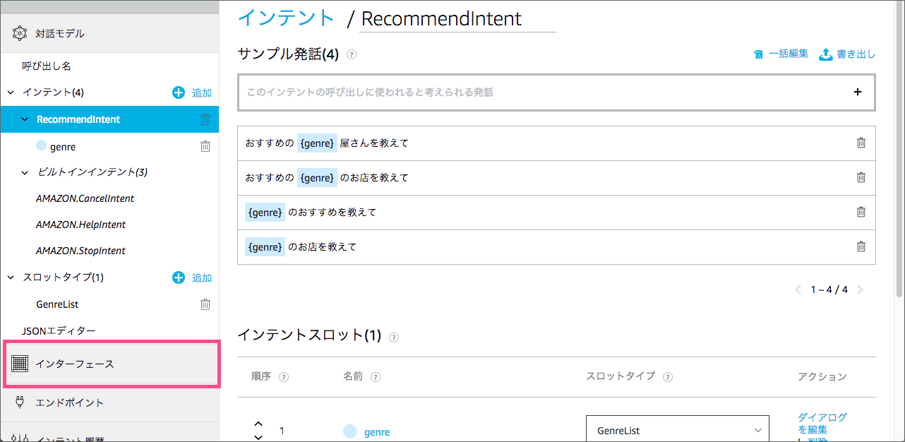
16. DisplayインターフェースをONにし「インターフェースを保存」をクリックします。今はEcho Spotを利用するためのおまじないだと思ってください。 
	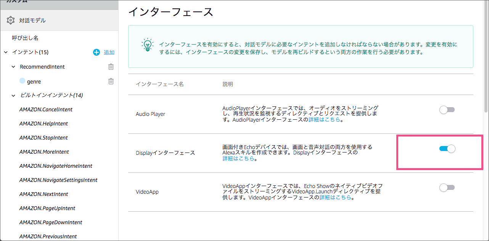
17. 再度「モデルをビルド」します。
	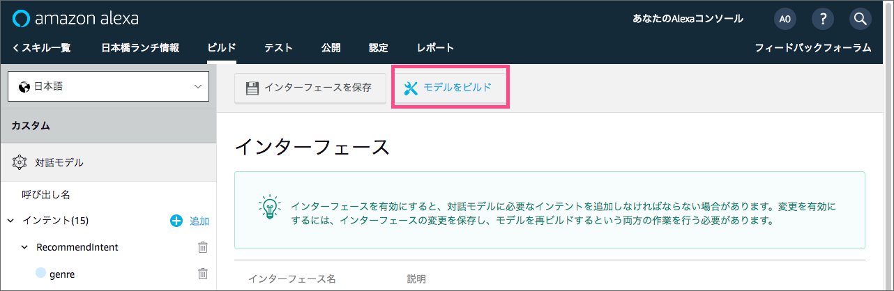

これで対話モデル側は完成です。

### 4-5 対話モデルにエンドポイントを登録する

対話モデルが完成したら、あらかじめ作成しておいたエンドポイントと接続しましょう。エンドポイントはサーバープログラムで作られています。インテントとスロットを受け取り、kintoneアプリにアクセスして必要な情報を受け取り、応答文字列または画像データを返すプログラムが動作するようになっています。

1. スキルビルダーの左パネルの「エンドポイント」をクリックします。
	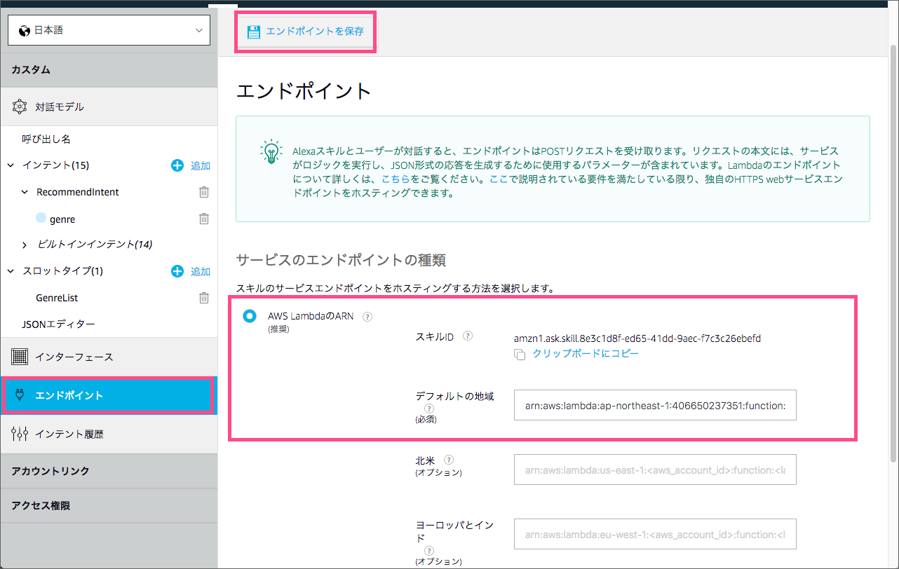
2. サービスのエンドポイントの種類では「AWS LambdaのARN」を選択します。
3. デフォルトの地域の項目に、以下の文字列をコピーし貼り付けます。
	
	`arn:aws:lambda:ap-northeast-1:406650237351:function:NihonbashiLunch`
	
4. 「エンドポイントの保存」ボタンをクリックします。
5. 以上で、スキルは概ね完成です。

### 4-6 AlexaシミュレーターまたはEchoデバイスを使ってテストをする

スキルが概ね完成したら、Alexaシミュレーターで動作テストをしてみましょう。

1. Alexa開発者コンソールの「テスト」をクリックします。
	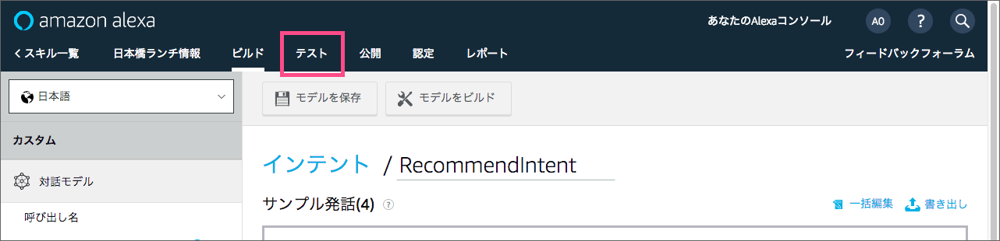
2. 初回はテストは無効になっているので、トグルスイッチをONにします。
	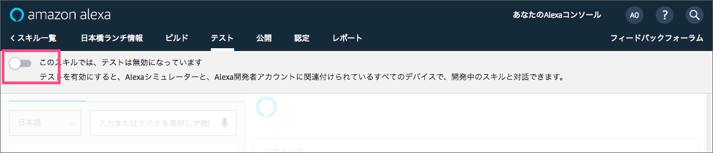
3. 画面左上の入力枠に、以下のようなサンプル発話をタイプ入力し[ENTER]キーを押してください（以下は例です。ご自身で登録した発話を入力してください）。

	**`日本橋ランチ情報で、おすすめの中華の店を教えて`**

	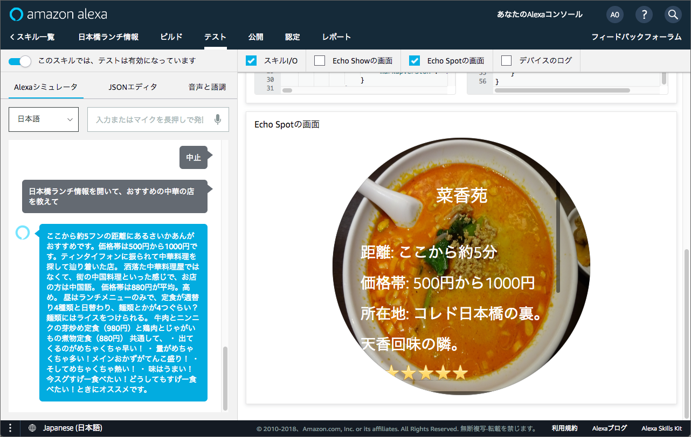

4. いくつか別のサンプル発話でもテストしてみましょう。
5. テキスト入力で動作が確認できたら、マイクのアイコンを押しながらパソコンに向かって話してみましょう。音声がどのように認識され、Alexaとスキルがどのような情報をやり取りしているか、右側のJSON入力と、JSON出力の画面をみて観察しましょう。
6. Echo Show/Echo Spotの画面でどのように表示されるかも観察しましょう。

## 5. シノニム（同義語）を使ってもっと便利に

ここまででもスキルは概ねOKですが、シノニムという機能を使うとより自然な会話に近づけることができます。

例えば、「餃子が食べたい」「ラーメンがいいなぁ」「チャーハンの美味しいお店を教えて」というのは「おすすめの中華のお店を教えて」というの同じ意味と捉えることができますよね？

これをAlexaを使って実現してみましょう。

1. RecommendIntentに以下のようなサンプル発話を追加しましょう。すでにあれば入力は不要です。

	- 「{genre} が食べたい」
	- 「{genre} がいいなぁ」
	- 「{genre} にしようかな」
	- 「{genre} の美味しいお店を教えて」
	
	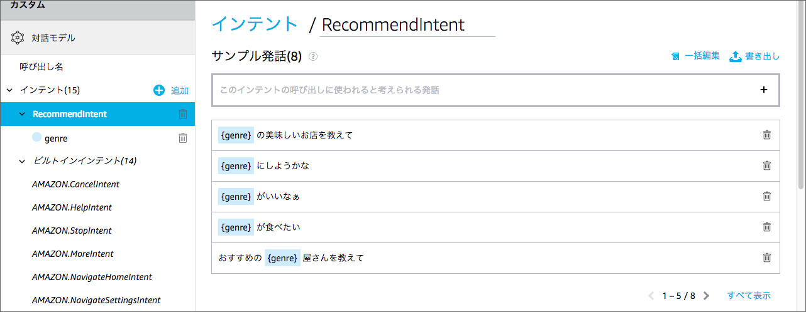

2. 次に**同義語**の項目に、各ジャンルの代表的なメニューの名前を入力します。例えば「中華」の場合「餃子」「チャーハン」「麻婆豆腐」「ラーメン」などです。こうすることで、「中華を食べたい」と「ラーメンを食べたい」はどちらもRecommendIntentに紐づけられ、スロット値は「中華」で受け取ることができるようになります。
	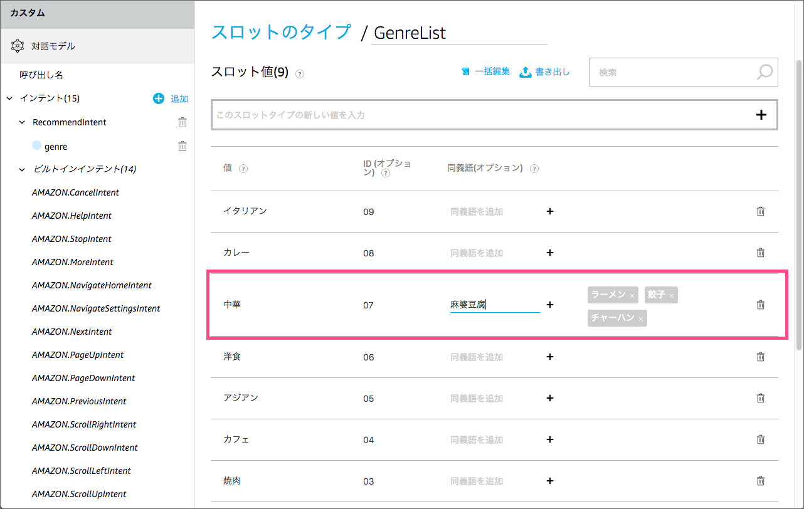
3. 他のジャンルにも代表的なメニューを追加し、忘れずに「モデルを保存」「モデルをビルド」しましょう。
	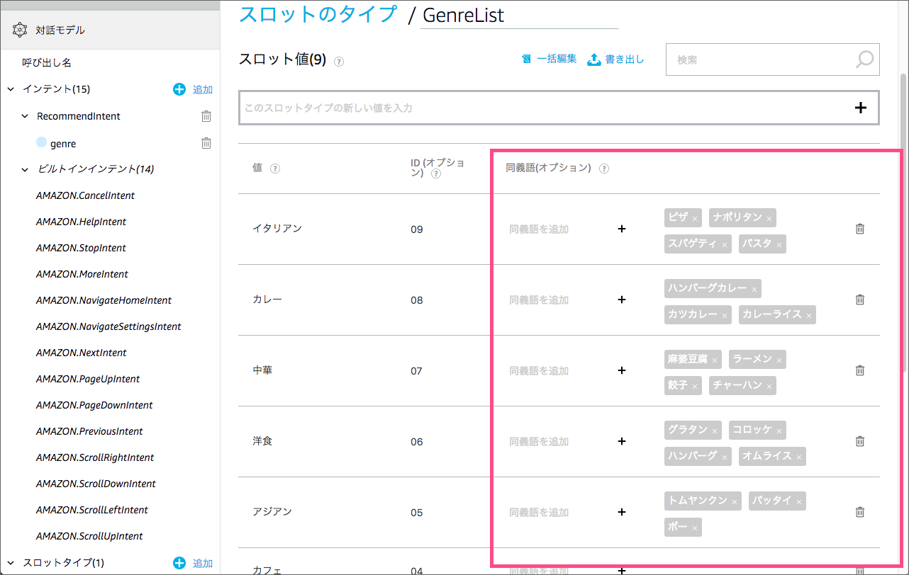
4. alexaシミュレーターでテストしてみましょう。

	**`日本橋ランチ情報で、ハンバーグが食べたい`**

	洋食のお店を紹介されれば成功です。こちらの方がより自然な言い方ではないでしょうか？

## 6. 応用を考える

今回は、kintoneを使って複数の利用者に口コミ情報などのデータを入力してもらい、利用者はAlexaを使ってハンズフリーでそれらのデータにアクセスできる事例でした。

こうしたパターンの応用例としては、以下のようなものが考えられます。

* 周辺の美容室情報
* 近隣の病院情報
* 特定地域のコワーキングスペース情報

などなど。便利なkintoneアプリと、それにアクセスするalexaスキルの組み合わせを考えてみてください。

